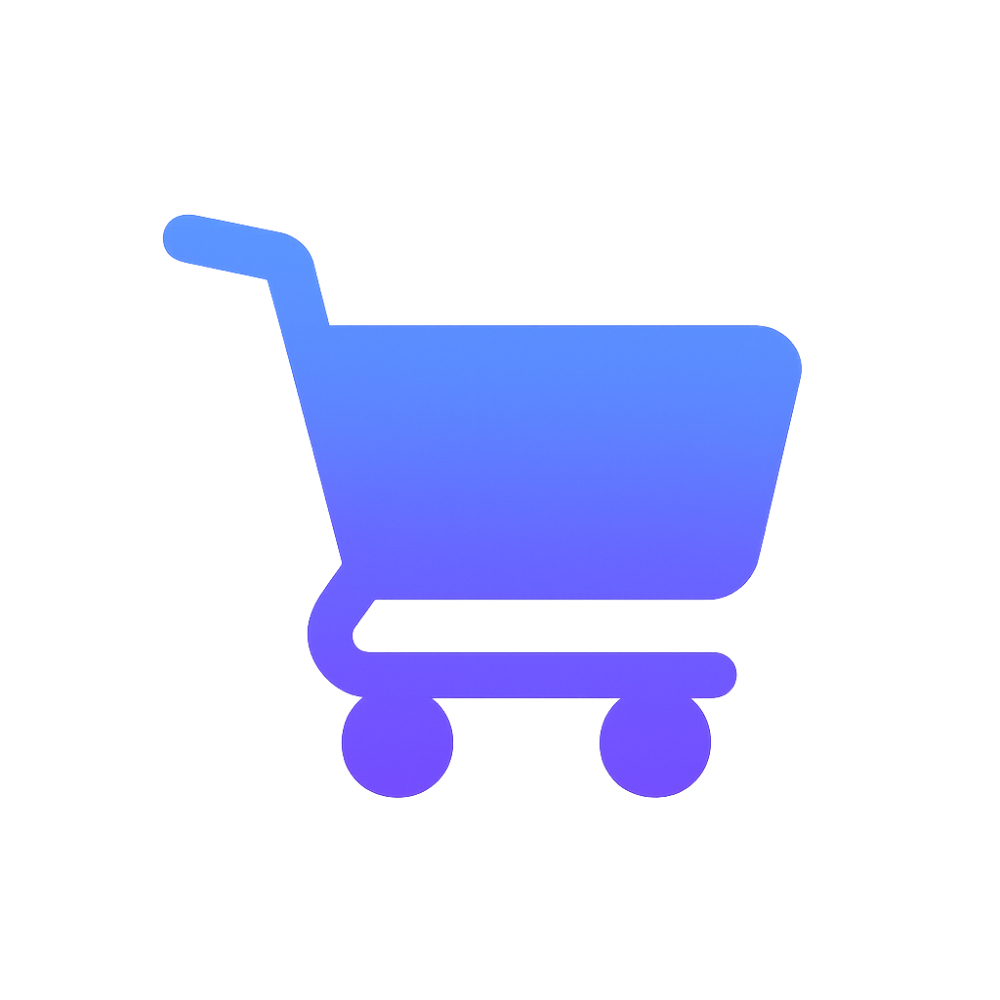

# 🛍️ SmartRetail - Next-Generation Shopping Experience

A cutting-edge e-commerce platform that combines AI-powered search, augmented reality, and smart analytics to revolutionize the shopping experience.



## ✨ Features

### 🎤 **Voice Search**
- **Natural Language Processing**: Search products using conversational voice commands
- **Real-time Recognition**: Instant voice-to-text conversion with visual feedback
- **Smart Suggestions**: AI-powered search suggestions based on your query
- **Hands-free Shopping**: Complete shopping experience using only your voice

### 📷 **Visual Search**
- **Image Recognition**: Upload photos to find similar products instantly
- **AI-Powered Matching**: Advanced algorithms identify products from images
- **Visual Similarity**: Find products that match your style and preferences
- **Quick Results**: Get instant product matches with detailed information

### 🥽 **Augmented Reality (AR) Try Room**
- **True-to-Scale Visualization**: See products at actual size in your space
- **360° Product Viewing**: Rotate and examine products from every angle
- **Real-time Placement**: Position products in your environment instantly
- **Direct Purchase**: Buy directly from the AR experience with one click

### 📊 **Smart Analytics Dashboard**
- **Spending Insights**: Track your shopping patterns and spending habits
- **Savings Opportunities**: AI identifies potential savings and deals
- **Visual Charts**: Interactive charts showing spending vs. savings trends
- **Category Analysis**: Breakdown of spending by product categories
- **Personalized Recommendations**: Tailored suggestions based on your behavior

### 📦 **Advanced Order Tracking**
- **Real-time Updates**: Live tracking of your package delivery status
- **Visual Timeline**: Interactive progress indicators for each order
- **Detailed Information**: Complete order history with item breakdowns
- **Delivery Estimates**: Accurate delivery predictions and notifications

### 🛒 **Digital Aisle Experience**
- **Interactive Product Discovery**: Swipe through digital aisles like a real store
- **Category Navigation**: Browse products by category with smooth transitions
- **Quick Actions**: Add to cart, try AR, or quick view with one tap
- **Personalized Layout**: AI-curated product arrangements based on preferences

## 🚀 Technology Stack

- **Frontend**: React 18 with TypeScript
- **Styling**: Tailwind CSS for modern, responsive design
- **Animations**: Framer Motion for smooth, engaging interactions
- **Charts**: Recharts for data visualization
- **Icons**: Lucide React for consistent iconography
- **Routing**: React Router DOM for seamless navigation
- **Build Tool**: Vite for fast development and optimized builds

## 🎯 Key Features Breakdown

### Voice Search Capabilities
- **Natural Commands**: "Find me a red dress under $50"
- **Product Categories**: "Show me electronics on sale"
- **Smart Filters**: "I need something for outdoor activities"
- **Voice Feedback**: Real-time audio confirmation of commands

### AR Technology Features
- **Room Scanning**: Automatically detects your space dimensions
- **Product Scaling**: Accurate size representation in your environment
- **Lighting Adaptation**: Products adjust to your room's lighting
- **Multi-Product Viewing**: Compare multiple items simultaneously

### Analytics & Insights
- **Spending Trends**: Monthly and yearly spending analysis
- **Savings Tracking**: Monitor your savings progress over time
- **Category Breakdown**: Visual representation of spending by category
- **Opportunity Alerts**: Notifications for potential savings

### Order Management
- **Status Tracking**: Real-time updates on order progress
- **Delivery Timeline**: Visual representation of delivery stages
- **Order History**: Complete record of all past purchases
- **Quick Reorder**: One-click reordering of previous items

## 🎨 Design Philosophy

- **Modern UI/UX**: Clean, intuitive interface with smooth animations
- **Mobile-First**: Responsive design that works on all devices
- **Accessibility**: WCAG compliant with keyboard navigation support
- **Performance**: Optimized for fast loading and smooth interactions
- **User-Centric**: Every feature designed with user experience in mind

## 🛠️ Getting Started

### Prerequisites
- Node.js (v16 or higher)
- npm or yarn package manager

### Installation

1. **Clone the repository**
   ```bash
   git clone https://github.com/yourusername/smartretail.git
   cd smartretail
   ```

2. **Install dependencies**
   ```bash
   npm install
   ```

3. **Start the development server**
   ```bash
   npm run dev
   ```

4. **Open your browser**
   Navigate to `http://localhost:5173`

### Available Scripts

- `npm run dev` - Start development server
- `npm run build` - Build for production
- `npm run preview` - Preview production build
- `npm run lint` - Run ESLint for code quality

## 📱 Pages Overview

### 🏠 **Home Page**
- Hero section with feature highlights
- Voice and image search interfaces
- Digital aisle swiper
- Feature showcase with animations

### 📦 **Orders Page**
- Order list with status indicators
- Interactive order tracker
- Detailed order information
- Real-time status updates

### 📊 **Analytics Dashboard**
- Spending and savings statistics
- Interactive charts and graphs
- Savings opportunities
- Category breakdown analysis

### 🥽 **AR Try Room**
- AR-enabled product selection
- Virtual try-on experience
- Product placement simulation
- Direct purchase integration

## 🔮 Future Enhancements

- **AI Chatbot**: Intelligent shopping assistant
- **Social Shopping**: Share and discover with friends
- **Voice Commerce**: Complete voice-controlled shopping
- **AR Social**: Share AR experiences with others
- **Predictive Analytics**: Advanced spending predictions
- **Smart Notifications**: Personalized deal alerts

## 🤝 Contributing

We welcome contributions! Please see our [Contributing Guidelines](CONTRIBUTING.md) for details.

## 📄 License

This project is licensed under the MIT License - see the [LICENSE](LICENSE) file for details.

## 🙏 Acknowledgments

- Built with modern web technologies
- Inspired by the future of retail technology
- Designed for optimal user experience
- Powered by AI and AR innovation

---

**Experience the future of shopping today with SmartRetail! 🚀**
